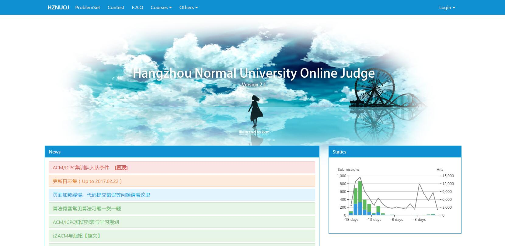
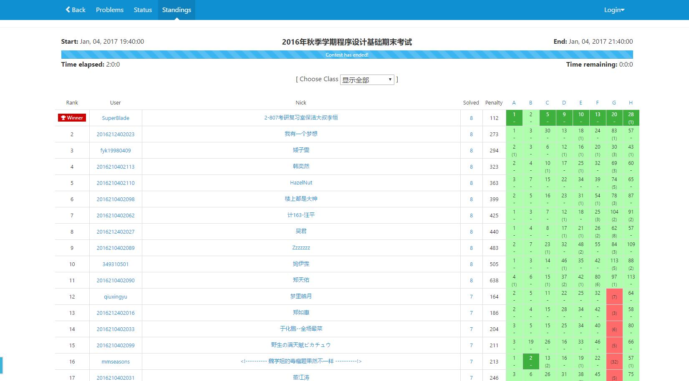
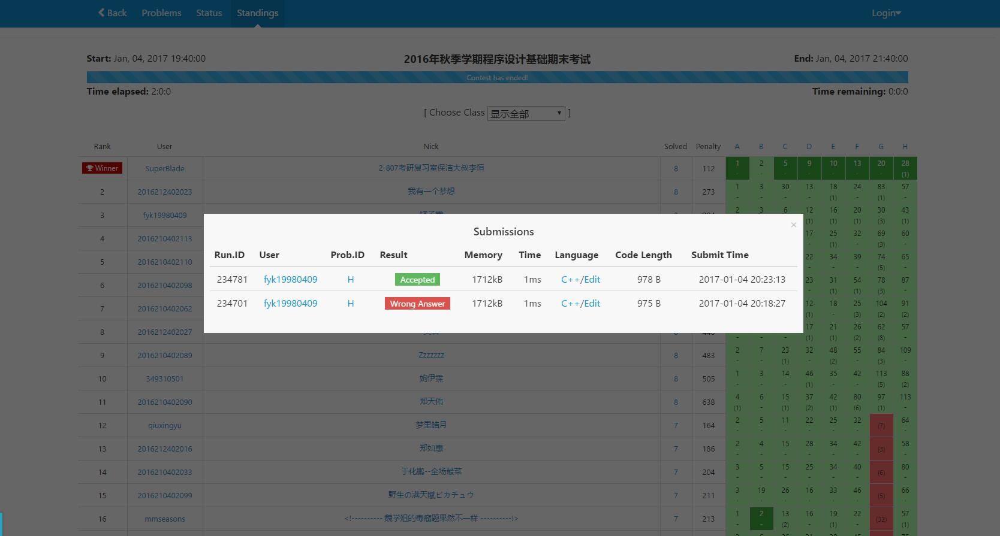
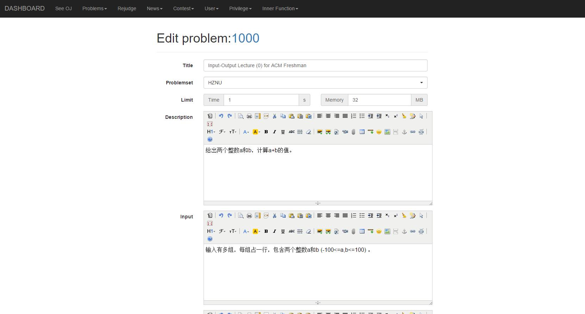
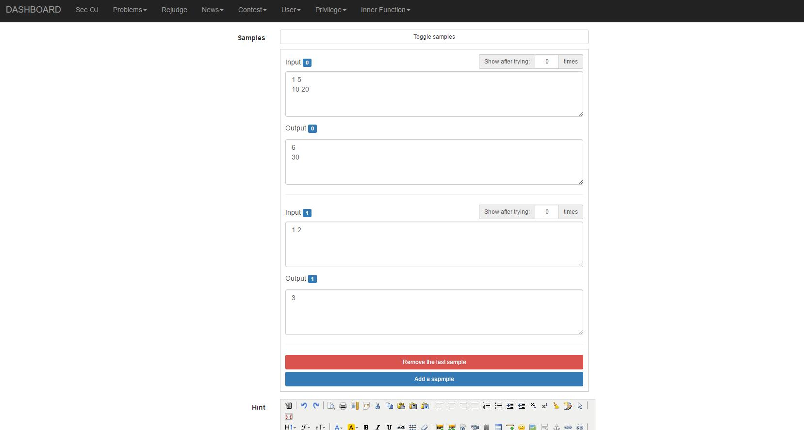
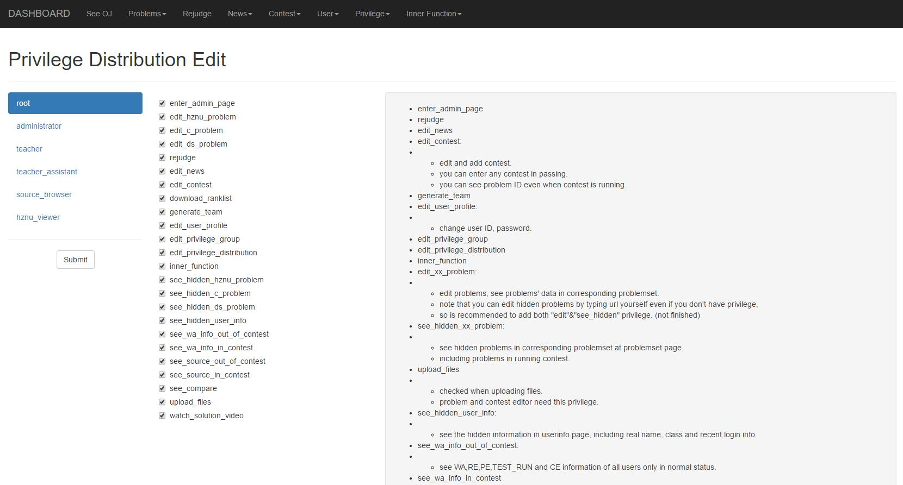

# HZNUOJ

**HZNUOJ 是基于 [HUSTOJ](https://github.com/zhblue/hustoj) 改造而来的，遵循 GPL 协议开源**

## 部署指南

### 使用 Docker（推荐）

### 构建镜像

在仓库根目录下：

```bash
docker build -t hznuoj:latest -f docker/Dockerfile ./
```

等待 build 完成即可。

完成后 `docker image ls`，若有看到 hznuoj 的镜像即为成功。

### 启动容器

```bash
docker run -it --rm -p 8001:80 -d \
--name=hznuoj \
-v /var/hznuoj/static.php:/var/www/web/OJ/include/static.php \
-v /var/hznuoj/upload:/var/www/web/OJ/upload \
-v /var/hznuoj-judge/data:/var/hznuoj/data \
hznuoj:latest
```

其中 `-p 8001:80` 表示把容器的 80 端口映射到宿主机的 8001 端口，可自行修改，可以直接改成 http 默认的 80 端口以省去网址里的端口号。

`--rm` 表示运行一次就删除容器，如果你想长期运行，当虚拟机用，需要去掉。

然后访问 localhost:8001 即可。

### 进入容器

```bash
docker exec -it hznuoj bash
```

## 使用教程

默认管理员账号为 admin/123456。

出题手册见 https://www.yuque.com/weilixinlianxin/zcf10d/yfk05w

## 优势

* 更华丽的界面
* 更灵活的权限管理
* 支持多组样例
* 有封装好的Docker镜像，一键部署

## 界面截图

### 首页

支持提交量和访问量的统计



### 榜单

重写过的的榜单



能点开查看每题的提交状况



### 题目编辑界面



多样例支持



### 权限管理界面

细分的权限分配


